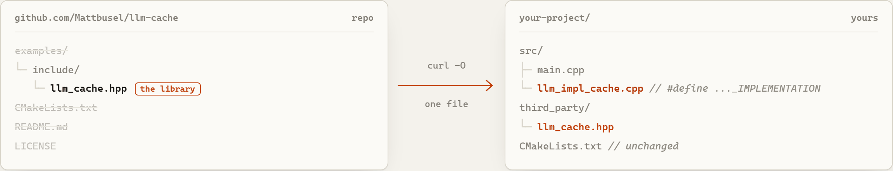

# llm-cpp reference

Everything about the 26 libraries in one place. Back to the [README](../README.md) or the [catalogue site](https://mattbusel.github.io/llm-cpp/).

## By task

| I want to... | Use |
|---|---|
| Call a model and stream tokens | [llm-stream](https://github.com/Mattbusel/llm-stream) |
| Build a chatbot with memory | [llm-chat](https://github.com/Mattbusel/llm-chat) + [llm-retry](https://github.com/Mattbusel/llm-retry) |
| Answer questions over my documents | [llm-parse](https://github.com/Mattbusel/llm-parse) + [llm-embed](https://github.com/Mattbusel/llm-embed) or [llm-rag](https://github.com/Mattbusel/llm-rag) + [llm-rank](https://github.com/Mattbusel/llm-rank) |
| Get valid JSON back every time | [llm-format](https://github.com/Mattbusel/llm-format) + [llm-json](https://github.com/Mattbusel/llm-json) |
| Let the model call my C++ functions | [llm-agent](https://github.com/Mattbusel/llm-agent) |
| Know what my calls cost and where time goes | [llm-cost](https://github.com/Mattbusel/llm-cost) + [llm-log](https://github.com/Mattbusel/llm-log) + [llm-trace](https://github.com/Mattbusel/llm-trace) |
| Unit-test LLM code without the network | [llm-mock](https://github.com/Mattbusel/llm-mock) |

## The libraries

"libcurl" means the implementation makes HTTPS calls (OpenAI and/or Anthropic APIs). "none" means it is fully offline and uses only the standard library.

### Core

| Library | What it does | Needs |
|---|---|---|
| [llm-stream](https://github.com/Mattbusel/llm-stream) | Stream OpenAI and Anthropic chat responses token by token over SSE | libcurl |
| [llm-retry](https://github.com/Mattbusel/llm-retry) | Exponential backoff with jitter, provider failover and a circuit breaker | none |
| [llm-cost](https://github.com/Mattbusel/llm-cost) | Approximate token counts and cost estimates for built-in OpenAI and Anthropic models, budget checks | none |
| [llm-cache](https://github.com/Mattbusel/llm-cache) | LRU response cache with TTL and hit/miss stats, so identical prompts skip the API | none |
| [llm-format](https://github.com/Mattbusel/llm-format) | Define a schema, validate model JSON against it, and re-prompt until the output conforms | none |
| [llm-json](https://github.com/Mattbusel/llm-json) | Small JSON parser and builder for request bodies and model output | none |

### Data and retrieval

| Library | What it does | Needs |
|---|---|---|
| [llm-parse](https://github.com/Mattbusel/llm-parse) | Strip HTML and markdown, extract titles, links, headings and code blocks, chunk text | none |
| [llm-embed](https://github.com/Mattbusel/llm-embed) | OpenAI embeddings, cosine/dot/euclidean similarity and a small on-disk vector store | libcurl |
| [llm-rag](https://github.com/Mattbusel/llm-rag) | End-to-end RAG: chunk, embed, persist an index, retrieve top-k and answer | libcurl |
| [llm-rank](https://github.com/Mattbusel/llm-rank) | Rerank passages with offline BM25, LLM relevance scoring, or a hybrid of both | libcurl (linked; BM25 itself is offline) |
| [llm-compress](https://github.com/Mattbusel/llm-compress) | Shrink conversation history: head/tail/smart truncation, sliding window, LLM summary | none (libcurl only with `LLM_COMPRESS_SUMMARIZE`) |
| [llm-batch](https://github.com/Mattbusel/llm-batch) | Run a JSONL file of prompts through a thread pool with rate limiting and resumable checkpoints | libcurl |

### Operations and testing

| Library | What it does | Needs |
|---|---|---|
| [llm-log](https://github.com/Mattbusel/llm-log) | Structured JSONL log of every call with latency, tokens and cost, plus query and summary | none |
| [llm-trace](https://github.com/Mattbusel/llm-trace) | RAII spans with parent/child nesting, token and cost attributes, OTLP-style JSON export | none |
| [llm-pool](https://github.com/Mattbusel/llm-pool) | Worker pool with priority queue and requests-per-minute and tokens-per-minute limits | none |
| [llm-mock](https://github.com/Mattbusel/llm-mock) | Fake LLM with scripted, pattern, random or echo responses, simulated latency and streaming | none |
| [llm-eval](https://github.com/Mattbusel/llm-eval) | Run a prompt N times, measure consistency, compare models or prompts, score responses | libcurl |
| [llm-ab](https://github.com/Mattbusel/llm-ab) | A/B test prompts or models with Welch's t-test, Cohen's d and custom scorers | libcurl |

### Application features

| Library | What it does | Needs |
|---|---|---|
| [llm-chat](https://github.com/Mattbusel/llm-chat) | Multi-turn conversation with token-budget trimming, pinned system prompt, save and restore | libcurl |
| [llm-agent](https://github.com/Mattbusel/llm-agent) | Tool-calling agent loop: register C++ lambdas as tools and let the model call them | libcurl |
| [llm-vision](https://github.com/Mattbusel/llm-vision) | Send images (file or URL) plus a prompt to OpenAI or Anthropic vision models | libcurl |
| [llm-template](https://github.com/Mattbusel/llm-template) | Mustache-style prompt templates with loops, conditionals and token-budget truncation | none |
| [llm-router](https://github.com/Mattbusel/llm-router) | Pick a model per prompt from a complexity score and a cost, latency, quality or budget strategy | none |
| [llm-guard](https://github.com/Mattbusel/llm-guard) | Detect and scrub PII (email, phone, SSN, card numbers, API keys) and score prompt-injection risk | none |
| [llm-audio](https://github.com/Mattbusel/llm-audio) | Whisper transcription and translation, and text-to-speech, via the OpenAI API | libcurl |
| [llm-finetune](https://github.com/Mattbusel/llm-finetune) | OpenAI fine-tuning lifecycle: write JSONL, upload, create, poll, cancel, list models | libcurl |

## Why single-header

<picture>
  <source media="(prefers-color-scheme: dark)" srcset="../assets/one-file-dark.png">
  
</picture>

- **Nothing to install.** `curl -O` one file, `#include` it. It works the same with CMake, Make, Bazel, MSBuild or a one-line `g++` command.
- **You can read all of it.** Each library is 210 to 572 lines; all 26 together are 8,948 (counted 2026-09-28). When something misbehaves you open one file, not a dependency tree.
- **You pay for what you use.** Need retries and a cache? Take two headers. Nothing else is pulled in, and the offline ones add no link dependencies at all.
- **Easy to vendor.** Copy the headers into `third_party/`, pin them in your own repo, patch them if you need to. No version resolver involved.

## Requirements

| | |
|---|---|
| Language | C++17 or later |
| Compilers | GCC, Clang, MSVC. Each library repo builds its examples in CI with CMake. |
| Network libraries | libcurl: preinstalled on macOS, `apt install libcurl4-openssl-dev` on Debian/Ubuntu, `vcpkg install curl` on Windows |
| Providers | OpenAI-compatible chat, embeddings, audio and fine-tuning endpoints; Anthropic Messages API in llm-stream and llm-vision |

## Status

These are small, focused libraries, not a full SDK. The HTTP code targets the public OpenAI and Anthropic endpoints and uses hand-written JSON handling, and token counts in llm-cost are approximations. Issues and pull requests are welcome in the individual repositories.

## Related

- [LLMTokenStreamQuantEngine](https://github.com/Mattbusel/LLMTokenStreamQuantEngine): C++20 engine that turns streaming LLM tokens into trade signals.
